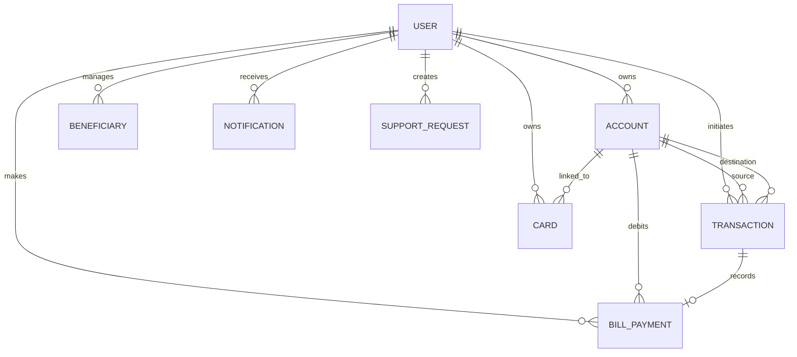

# Apex Bank — Digital Banking Account & Transaction Management System

A polished academic digital banking platform built for the 5th Semester Christ University CIA-3 project. It demonstrates Node.js, Express.js, MongoDB/Mongoose, JWT authentication, bcrypt password hashing, server-side validation, RBAC, transaction workflows, reporting, and a responsive banking UI.

## What is implemented

- Customer registration/login with JWT + bcrypt
- Role-based access control for CUSTOMER, BANK_STAFF and BANK_ADMIN
- Savings/current account management
- Account freeze/unfreeze/closure controls
- Deposits and withdrawals with balance validation
- Atomic inter-account transfers using MongoDB sessions
- Immutable transaction ledger with filtering and pagination
- Beneficiary management
- Debit card lifecycle simulation
- Bill payments
- Notifications
- Customer support workflow
- Admin users/accounts/transactions views
- Admin banking reports and aggregation-based analytics
- CSV-friendly statement endpoint design
- Centralized validation and error handling
- Security middleware and auth rate limiting
- Automated test suite and complete Postman collection
- Responsive frontend dashboard

## Technology

Node.js + Express.js, MongoDB + Mongoose, JWT, bcryptjs, express-validator, Helmet, CORS, Morgan, compression, Jest and Supertest.

## Architecture

Routes receive HTTP requests and validation middleware. Controllers coordinate application behavior. Services hold financial business rules. Mongoose models define persistence. Centralized error middleware converts expected and unexpected failures into a consistent JSON envelope.

## Database relationships



References are used for entities such as users, accounts and transactions because they are independently updated and queried. Transaction and payment records preserve useful snapshots such as balanceBefore/balanceAfter so historical financial activity remains explainable even if current account data changes.

## Environment

Copy `.env.example` to `.env`.

For Docker MongoDB, use:

```env
MONGODB_URI=mongodb://localhost:27017/digital_banking?replicaSet=rs0
```

## Run with Docker MongoDB

```bash
docker compose up -d
npm install
npm run seed
npm run dev
```

Then open http://localhost:5000/

## Run with an existing MongoDB

```bash
npm install
npm run seed
npm start
```

Transfers use MongoDB transactions, so the MongoDB deployment should support replica sets/transactions.

## Demo accounts

Admin: `admin@apexbank.demo` / `Admin@12345`

Customer: `customer1@apexbank.demo` / `Customer@12345`

Customer: `customer2@apexbank.demo` / `Customer@12345`

These are development demo credentials only.

## API overview

### Authentication

POST `/api/auth/register`
POST `/api/auth/login`
POST `/api/auth/logout`
GET `/api/auth/me`

### Accounts

POST `/api/accounts`
GET `/api/accounts/my`
GET `/api/accounts/:id`
GET `/api/accounts/:id/statement`
PATCH `/api/accounts/:id/freeze`
PATCH `/api/accounts/:id/unfreeze`
PATCH `/api/accounts/:id/close`

### Transactions

POST `/api/transactions/deposit`
POST `/api/transactions/withdraw`
POST `/api/transactions/transfer`
GET `/api/transactions/my`
GET `/api/transactions/:id`
PATCH `/api/transactions/:id/status`

### Beneficiaries

POST/GET `/api/beneficiaries`
GET/PUT/DELETE `/api/beneficiaries/:id`

### Cards

GET `/api/cards`
GET `/api/cards/:id`
POST `/api/cards`
PATCH `/api/cards/:id/block`
PATCH `/api/cards/:id/unblock`

### Bill payments

POST `/api/bill-payments`
GET `/api/bill-payments`
GET `/api/bill-payments/:id`

### Notifications

GET `/api/notifications`
PATCH `/api/notifications/:id/read`
PATCH `/api/notifications/read-all`

### Support

POST `/api/support`
GET `/api/support`
GET `/api/support/:id`
GET `/api/support/admin/all`
PATCH `/api/support/:id/status`

### Admin

GET `/api/admin/users`
PATCH `/api/admin/users/:id/status`
GET `/api/admin/accounts`
GET `/api/admin/transactions`
GET `/api/admin/reports`
GET `/api/admin/analytics`

## Error contract

```json
{
  "success": false,
  "message": "Insufficient funds",
  "errorCode": "INSUFFICIENT_FUNDS"
}
```

Typical statuses are 400 validation errors, 401 authentication errors, 403 authorization failures, 404 missing resources, and 409 business-rule conflicts.

## Business rules demonstrated

- Users can only access their own accounts and transactions.
- Customers cannot access admin operations.
- Frozen/closed accounts cannot perform prohibited transactions.
- Withdrawals and transfers reject insufficient funds.
- Self-transfers are rejected.
- Transaction status transitions are controlled by a state machine.
- Financial amounts are calculated on the server.
- Duplicate email/beneficiary records are rejected.
- Transaction history is not editable by ordinary users.
- Transfer account updates use a database transaction to avoid partial money movement.

## Testing

```bash
npm test
```

The tests use `mongodb-memory-server` for isolated automated checks. The full demo environment can use Docker MongoDB.

## Postman

Import `postman/Digital-Banking.postman_collection.json` and `postman/Digital-Banking.postman_environment.json`. The login request stores the JWT automatically.

## Repository hygiene

`.env` is ignored. No banking credentials, API keys, JWT secrets or CVV/PIN values are committed.

## Academic note

This is a simulated educational banking system. It does not connect to real banking rails, payment gateways, card networks or customer financial systems.
